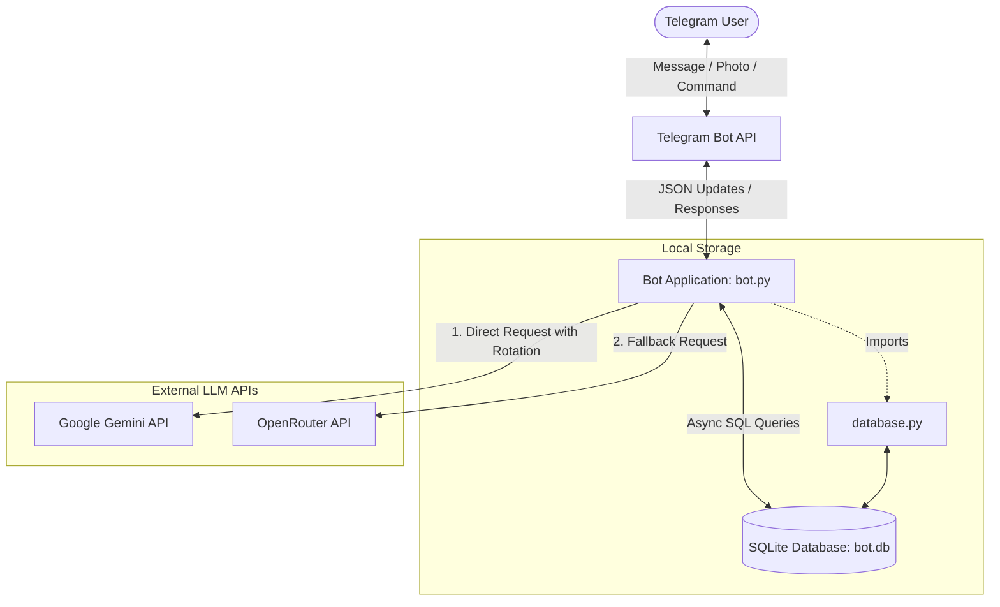
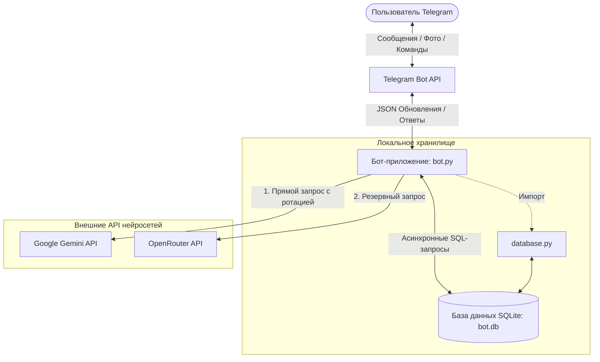

# 🤖 Multi-functional Telegram Bot / Многофункциональный Telegram Бот

[English](#english) | [Русский](#русский)

---

## English

A multi-functional Telegram bot built using the `python-telegram-bot` framework. The bot integrates with **Google Gemini API** (with API key rotation/pooling) and **OpenRouter** (as a fallback) to provide intelligent assistance across various modes (Nutrition tracking, Mathematics, and general conversational Chat). It uses **SQLite** with `aiosqlite` for database persistence.

### 📋 Features

- 🍏 **Nutrition Mode**: Send a photo of food to get a description, ingredients, health benefits, and estimated calorie count.
- 🧮 **Math & LaTeX Mode**: Ask mathematical questions or send equations. The bot parses complex math and responds.
- 💬 **Conversational Chat**: Interactive chat mode with context memory (tracks the last 20 messages in conversation history).
- 🔄 **Direct LLM & Fallback Pool**: Implements Google Gemini API direct calls with key rotation, falling back to OpenRouter to ensure high availability.

### 🛠 User Commands

- `/start` - Initialize the bot, clear context, and display the welcome message.
- `/clear` - Clear the current conversation history/context.
- `/mode` - Switch between active modes (`general`, `math`, `nutrition`).
- `/stats` - View token usage, average latency, and requests breakdown per model.

---

### 📐 Architecture Diagram



---

### 🗄 Database Schema

The database `bot.db` contains three main tables managed by `database.py`:

#### 1. `users`
Stores user profile information and their selected operating mode.
| Column | Type | Constraints | Description |
| :--- | :--- | :--- | :--- |
| `user_id` | `INTEGER` | `PRIMARY KEY` | Unique Telegram user ID |
| `username` | `TEXT` | | Telegram username |
| `first_name` | `TEXT` | | User's first name |
| `last_name` | `TEXT` | | User's last name |
| `current_mode` | `TEXT` | `DEFAULT 'general'` | Active bot mode (`general`, `math`, `nutrition`) |
| `created_at` | `TIMESTAMP` | `DEFAULT CURRENT_TIMESTAMP` | Time of first bot interaction |

#### 2. `messages`
Stores message logs for context and conversation history.
| Column | Type | Constraints | Description |
| :--- | :--- | :--- | :--- |
| `id` | `INTEGER` | `PRIMARY KEY AUTOINCREMENT` | Auto-incrementing message ID |
| `user_id` | `INTEGER` | | Associated Telegram user ID |
| `role` | `TEXT` | | Message role (`user`, `assistant`, `system`) |
| `content` | `TEXT` | | Text content of the message |
| `timestamp` | `TIMESTAMP` | `DEFAULT CURRENT_TIMESTAMP` | Time the message was sent |

#### 3. `stats`
Tracks LLM invocation metrics for token usage and performance analysis.
| Column | Type | Constraints | Description |
| :--- | :--- | :--- | :--- |
| `id` | `INTEGER` | `PRIMARY KEY AUTOINCREMENT` | Auto-incrementing record ID |
| `user_id` | `INTEGER` | | Associated Telegram user ID |
| `model` | `TEXT` | | Model name used (e.g., `gemini-2.5-flash-lite`) |
| `prompt_tokens` | `INTEGER` | | Tokens sent in the prompt |
| `completion_tokens` | `INTEGER` | | Tokens received in the response |
| `latency` | `REAL` | | API response duration in seconds |
| `timestamp` | `TIMESTAMP` | `DEFAULT CURRENT_TIMESTAMP` | Time of the API call |

---

### 🚀 Setup & Deployment

#### Prerequisites
- Python 3.12+ (or Docker)
- Telegram Bot Token (obtained from [@BotFather](https://t.me/BotFather))
- Gemini API Key and/or OpenRouter API Key

#### Configuration
Create a `.env` file in the project root:
```env
TELEGRAM_BOT_TOKEN=your_telegram_bot_token

# Google Gemini API keys (comma-separated for key rotation / pool)
GOOGLE_API_KEYS=your_gemini_key_1,your_gemini_key_2

# OpenRouter API key for fallback
OPENROUTER_API_KEY=your_openrouter_key
```

#### Option A: Local Run
1. Create and activate a virtual environment:
   ```bash
   python3 -m venv .venv
   source .venv/bin/activate
   ```
2. Install dependencies:
   ```bash
   pip install -r requirements.txt
   ```
3. Run the bot:
   ```bash
   python bot.py
   ```

#### Option B: Docker (Recommended)
You can run the bot inside a lightweight Docker container. The SQLite database is mounted as a persistent volume.

1. Build and run using Docker Compose:
   ```bash
   docker compose up -d --build
   ```
2. View container logs:
   ```bash
   docker compose logs -f
   ```
3. Stop the container:
   ```bash
   docker compose down
   ```

---

## Русский

Многофункциональный Telegram бот, разработанный с использованием фреймворка `python-telegram-bot`. Бот интегрирован с **Google Gemini API** (с поддержкой ротации/пула ключей) и **OpenRouter** (в качестве резервного провайдера) для интеллектуавого анализа в различных режимах (подсчет калорий, математика, обычный чат). Для хранения данных используется база данных **SQLite** (`aiosqlite`).

### 📋 Возможности

- 🍏 **Режим Питания (Nutrition)**: Отправьте фото еды, чтобы получить описание состава, калорийность, БЖУ и пользу для здоровья.
- 🧮 **Режим Математики (Math & LaTeX)**: Задавайте математические вопросы или отправляйте формулы. Бот обрабатывает сложные вычисления.
- 💬 **Обычный чат**: Интерактивный диалог с поддержкой контекста (сохраняются последние 20 сообщений истории).
- 🔄 **Ротация ключей и резервные LLM**: Прямые вызовы Google Gemini API распределяются между доступными ключами, а при сбоях бот переключается на OpenRouter.

### 🛠 Команды пользователя

- `/start` - Инициализировать бота, сбросить контекст и показать приветствие.
- `/clear` - Очистить историю диалога в текущей сессии.
- `/mode` - Переключить активный режим работы (`general` — обычный, `math` — математика, `nutrition` — питание).
- `/stats` - Посмотреть статистику токенов, среднюю задержку и количество запросов по моделям.

---

### 📐 Диаграмма архитектуры



---

### 🗄 Схема базы данных

База данных `bot.db` содержит три таблицы, управляемые `database.py`:

#### 1. `users`
Содержит настройки пользователей и выбранные режимы.
| Столбец | Тип | Ограничения | Описание |
| :--- | :--- | :--- | :--- |
| `user_id` | `INTEGER` | `PRIMARY KEY` | Уникальный ID пользователя Telegram |
| `username` | `TEXT` | | Имя пользователя в Telegram |
| `first_name` | `TEXT` | | Имя |
| `last_name` | `TEXT` | | Фамилия |
| `current_mode` | `TEXT` | `DEFAULT 'general'` | Текущий режим работы (`general`, `math`, `nutrition`) |
| `created_at` | `TIMESTAMP` | `DEFAULT CURRENT_TIMESTAMP` | Время регистрации пользователя |

#### 2. `messages`
Журнал сообщений для сохранения контекста диалога.
| Столбец | Тип | Ограничения | Описание |
| :--- | :--- | :--- | :--- |
| `id` | `INTEGER` | `PRIMARY KEY AUTOINCREMENT` | Идентификатор сообщения |
| `user_id` | `INTEGER` | | ID пользователя Telegram |
| `role` | `TEXT` | | Роль (`user`, `assistant`, `system`) |
| `content` | `TEXT` | | Текст сообщения |
| `timestamp` | `TIMESTAMP` | `DEFAULT CURRENT_TIMESTAMP` | Время отправки |

#### 3. `stats`
Метрики использования LLM (токены, задержки, модели).
| Столбец | Тип | Ограничения | Описание |
| :--- | :--- | :--- | :--- |
| `id` | `INTEGER` | `PRIMARY KEY AUTOINCREMENT` | Идентификатор записи |
| `user_id` | `INTEGER` | | ID пользователя Telegram |
| `model` | `TEXT` | | Использованная модель (например, `gemini-2.5-flash-lite`) |
| `prompt_tokens` | `INTEGER` | | Токены входящего запроса |
| `completion_tokens` | `INTEGER` | | Токены исходящего ответа |
| `latency` | `REAL` | | Время ответа API в секундах |
| `timestamp` | `TIMESTAMP` | `DEFAULT CURRENT_TIMESTAMP` | Время запроса |

---

### 🚀 Запуск и Развертывание

#### Системные требования
- Python 3.12+ (or Docker)
- Telegram Bot Token (можно получить у [@BotFather](https://t.me/BotFather))
- API-ключ Gemini и/или OpenRouter

#### Настройка окружения
Создайте файл `.env` в корневой папке проекта:
```env
TELEGRAM_BOT_TOKEN=ваш_токен_telegram

# Ключи Google Gemini API (через запятую для ротации/пула)
GOOGLE_API_KEYS=ваш_ключ_gemini_1,ваш_ключ_gemini_2

# Ключ OpenRouter API для резервного переключения
OPENROUTER_API_KEY=ваш_ключ_openrouter
```

#### Вариант А: Локальный запуск
1. Создайте и активируйте виртуальное окружение:
   ```bash
   python3 -m venv .venv
   source .venv/bin/activate
   ```
2. Установите зависимости:
   ```bash
   pip install -r requirements.txt
   ```
3. Запустите бота:
   ```bash
   python bot.py
   ```

#### Вариант Б: Запуск в Docker (Рекомендуемый)
Бот запускается в легковесном контейнере Docker, а файл базы данных SQLite сохраняется на хосте через монтирование тома (volume).

1. Соберите образ и запустите контейнеры:
   ```bash
   docker compose up -d --build
   ```
2. Просмотр логов:
   ```bash
   docker compose logs -f
   ```
3. Остановить контейнер:
   ```bash
   docker compose down
   ```
