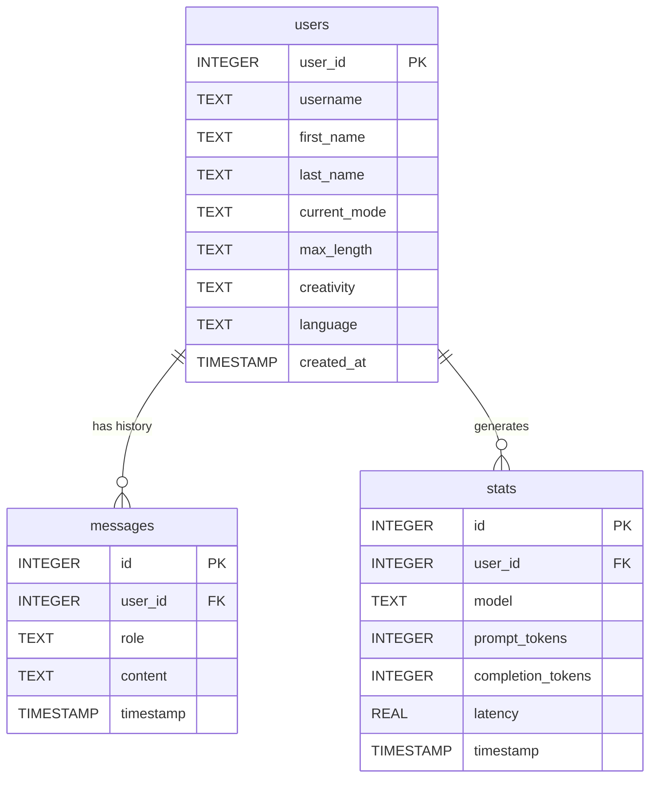

# 🤖 Telegram Multi-Mode AI Bot: User & Debugging Guide

Welcome to the comprehensive operations guide for the Telegram Multi-Mode AI Bot. This document outlines the system architecture, database design, environment setups, and debugging strategies.

---

## 📋 Table of Contents
1. [Overview & Bot Modes](#1-overview--bot-modes)
2. [Database Schema & Query Guide](#2-database-schema--query-guide)
3. [Setup & Deployment Instructions](#3-setup--deployment-instructions)
4. [Troubleshooting & Debugging Manual](#4-troubleshooting--debugging-manual)

---

## 1. Overview & Bot Modes

This Telegram bot is built on a modular architecture using the `python-telegram-bot` framework and leverages **Gemini 2.5 (Flash/Lite)** and **OpenRouter** models as a fallback. It supports three distinct conversational modes which users can switch between using the `/mode` command:

### 🍏 Nutrition Mode (`nutrition`)
*   **Purpose:** Helps users analyze the nutritional value, ingredients, health benefits, and calorie counts of their food.
*   **Capabilities:** Accepts text descriptions or direct photo uploads of meals. 
*   **Image Processing:** Extracts food composition from photos automatically.

### 🧮 Math Mode (`math`)
*   **Purpose:** Acts as a step-by-step math tutor.
*   **Capabilities:** Explains mathematical equations, formulas, and proofs on demand.
*   **Formatting:** Leverages LaTeX formatting (`$...$` for inline math and `$$...$$` for block math) cleanly parsed for Telegram MarkdownV2 without breaking characters.
*   **Multimodal Support:** Users can take a photo of a math problem, and the bot will solve it step-by-step.

### 💬 General Mode (`general`)
*   **Purpose:** A general-purpose conversational AI assistant.
*   **Capabilities:** Answers queries, writes text, drafts code, and answers questions. Supports photo uploads with detailed descriptions.

---

## 2. Database Schema & Query Guide

The bot uses an optimized **SQLite** database (`bot.db`) with **Write-Ahead Logging (WAL)** enabled to ensure safe concurrent operations and low latency.



### Table Specifications

#### 1. `users` Table
Stores registered bot users and their configurations.
*   `user_id` (INTEGER, Primary Key): Telegram user ID.
*   `username` (TEXT): Telegram username.
*   `first_name` (TEXT): First name.
*   `last_name` (TEXT): Last name.
*   `current_mode` (TEXT): Active mode (`general`, `math`, `nutrition`). Defaults to `general`.
*   `max_length` (TEXT): Response length setting (`short`, `medium`, `long`). Defaults to `medium`.
*   `creativity` (TEXT): Temperature setting (`precise`, `balanced`, `creative`). Defaults to `balanced`.
*   `language` (TEXT): System language (`ru`, `en`). Defaults to `ru`.
*   `created_at` (TIMESTAMP): Date registered.

#### 2. `messages` Table
Logs chat history for conversation context construction.
*   `id` (INTEGER, Primary Key, Autoincrement)
*   `user_id` (INTEGER, Foreign Key referencing `users(user_id)` ON DELETE CASCADE)
*   `role` (TEXT): Role of the messenger (`user` or `assistant`).
*   `content` (TEXT): Raw text content.
*   `timestamp` (TIMESTAMP): Message timestamp.
*   *Index:* `idx_messages_user_id` optimizes historical lookups.

#### 3. `stats` Table
Tracks token usage and performance metrics for all LLM transactions.
*   `id` (INTEGER, Primary Key, Autoincrement)
*   `user_id` (INTEGER, Foreign Key referencing `users(user_id)` ON DELETE CASCADE)
*   `model` (TEXT): Model name (e.g. `Gemini API (gemini-2.5-flash)`).
*   `prompt_tokens` (INTEGER): Estimated or actual prompt tokens used.
*   `completion_tokens` (INTEGER): Estimated or actual completion tokens used.
*   `latency` (REAL): Response latency in seconds.
*   `timestamp` (TIMESTAMP)
*   *Index:* `idx_stats_user_id` optimizes metrics queries.

---

### Analytical SQL Queries

To run diagnostics, open the SQLite shell:
```bash
sqlite3 bot.db
```

#### Query 1: Retrieve Overall Token Usage & Cost Estimates
```sql
SELECT 
    COUNT(*) AS total_requests,
    SUM(prompt_tokens) AS total_prompt_tokens,
    SUM(completion_tokens) AS total_completion_tokens,
    SUM(prompt_tokens + completion_tokens) AS total_tokens,
    ROUND(AVG(latency), 2) AS avg_latency_seconds
FROM stats;
```

#### Query 2: Breakdown Performance by Model
```sql
SELECT 
    model,
    COUNT(*) AS request_count,
    SUM(prompt_tokens + completion_tokens) AS total_tokens_used,
    ROUND(AVG(latency), 2) AS avg_latency_seconds
FROM stats
GROUP BY model
ORDER BY request_count DESC;
```

#### Query 3: Identify Active Users and Their Modes
```sql
SELECT 
    u.user_id,
    u.username,
    u.current_mode,
    COUNT(m.id) AS logged_messages
FROM users u
LEFT JOIN messages m ON u.user_id = m.user_id
GROUP BY u.user_id
ORDER BY logged_messages DESC;
```

---

## 3. Setup & Deployment Instructions

### Option A: Local Development Setup

#### Prerequisites
*   Python 3.12+
*   SQLite3

#### Steps
1.  **Clone & Navigate:**
    ```bash
    cd /Users/slvtveter/Desktop/PycharmProjects/bot_tg/
    ```
2.  **Configure Environment:**
    Create a `.env` file in the project root:
    ```env
    TELEGRAM_BOT_TOKEN="your_telegram_bot_token_here"
    GOOGLE_API_KEYS="key1,key2,key3"
    OPENROUTER_API_KEY="your_openrouter_api_key_here"
    DB_PATH="/Users/slvtveter/Desktop/PycharmProjects/bot_tg/bot.db"
    ```
3.  **Setup Virtual Environment:**
    ```bash
    python3 -m venv .venv
    source .venv/bin/activate
    pip install -r requirements.txt
    ```
4.  **Execute Unit Tests:**
    ```bash
    python -m unittest tests/test_suite.py
    ```
5.  **Run Loop-Test Runner (checks for flakiness):**
    ```bash
    python tests/run_checks.py
    ```
6.  **Run Bot Locally:**
    ```bash
    python bot.py
    ```

---

### Option B: Containerized Docker Deployment

The Docker container runs as a dedicated non-root system user (`botuser`) for isolation and mounts a persistent volume to preserve the database safely under Write-Ahead Logging (WAL) operations.

#### Steps
1.  **Build and Start:**
    ```bash
    docker compose up --build -d
    ```
2.  **Verify Status:**
    ```bash
    docker compose ps
    ```
3.  **Verify Non-Root Execution:**
    ```bash
    docker exec -it python_telegram_bot whoami
    # Expected output: botuser
    ```
4.  **Check Database Persistence:**
    Ensure database folders/volumes inside `/data` inside the container are mounted properly.

---

## 4. Troubleshooting & Debugging Manual

### 1. Handling Telegram MarkdownV2 Formatting Errors
Telegram's `MarkdownV2` parser is highly sensitive. Standard symbols like dots (`.`), exclamation marks (`!`), and hyphens (`-`) outside code blocks must be escaped.
*   **The Bug:** Earlier versions crashed when symbols resided *inside* styling entities like `**bold.!!**` (which parses to `*bold.!!*` but crashes because `.!!` isn't escaped).
*   **The Fix:** The bot now uses `escape_text_with_placeholders()` in `utils.py` to extract formatting regions (bold, italic, links) recursively and escape literal characters inside them correctly before re-assembling.
*   **Debugging:** If you receive a formatting error (`telegram.error.BadRequest: Can't parse entities`), inspect the raw text from the model and check if any special characters (like parentheses in URLs, braces, dots) are not escaped properly.

### 2. LLM Prompting & LaTeX Failures
In **Math Mode**, models sometimes produce LaTeX bracket configurations like `\begin{align}...\end{align}`. These do not render natively in Telegram clients and result in garbled text output.
*   **Resolution:** The math system prompt in `llm.py` enforces using `$` for inline math and `$$` for block math exclusively.
*   **Action:** If math rendering fails, ensure that model prompts are strictly formatted and the user has not injected raw LaTeX instructions.

### 3. API Key Rotation and Cooldown Pool
Direct Gemini API keys are rotated dynamically.
*   **Key Failure Handling:** When a key is rate-limited (HTTP 429) or invalid (HTTP 403), the custom `KeyPool` in `llm.py` flags it and places it on a 5-minute cooldown.
*   **Diagnostics:** If the bot response latency increases, check if direct Gemini keys are disabled, forcing the system to fallback to OpenRouter.

### 4. Database Lockups
In standard SQLite setups, concurrent writes (e.g. logging messages while gathering statistics) can trigger `sqlite3.OperationalError: database is locked`.
*   **System Fixes:**
    1.  **WAL Mode Enabled:** Writes do not block reads, and vice-versa.
    2.  **Busy Timeout:** The connection manager has a `busy_timeout = 10000` (10 seconds) configured to hold queries until locked processes complete.
    3.  **Foreign Keys Enforced:** Restricts orphans, automatically cascades message deletions if a user profile is cleared.
